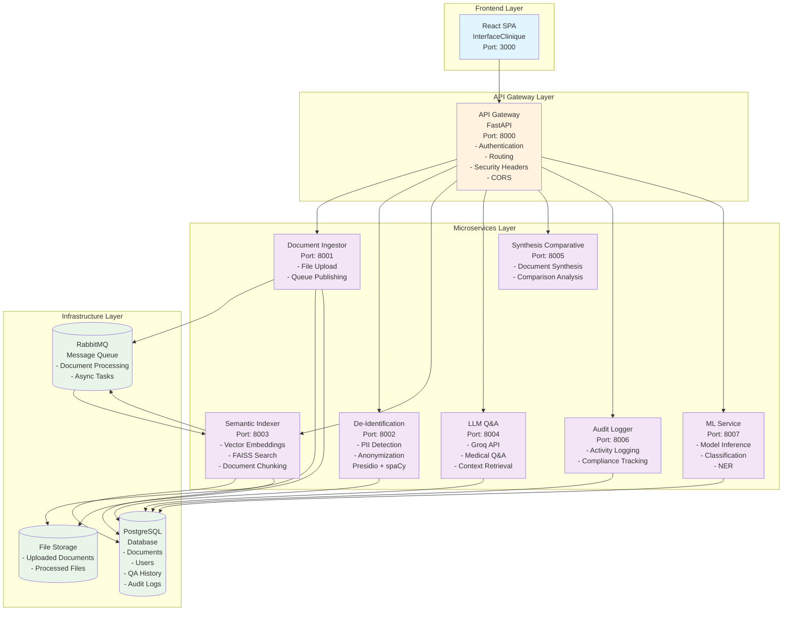
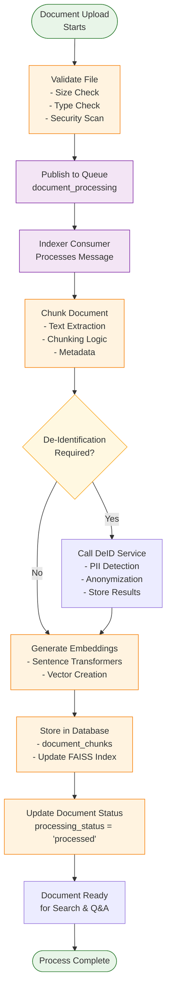
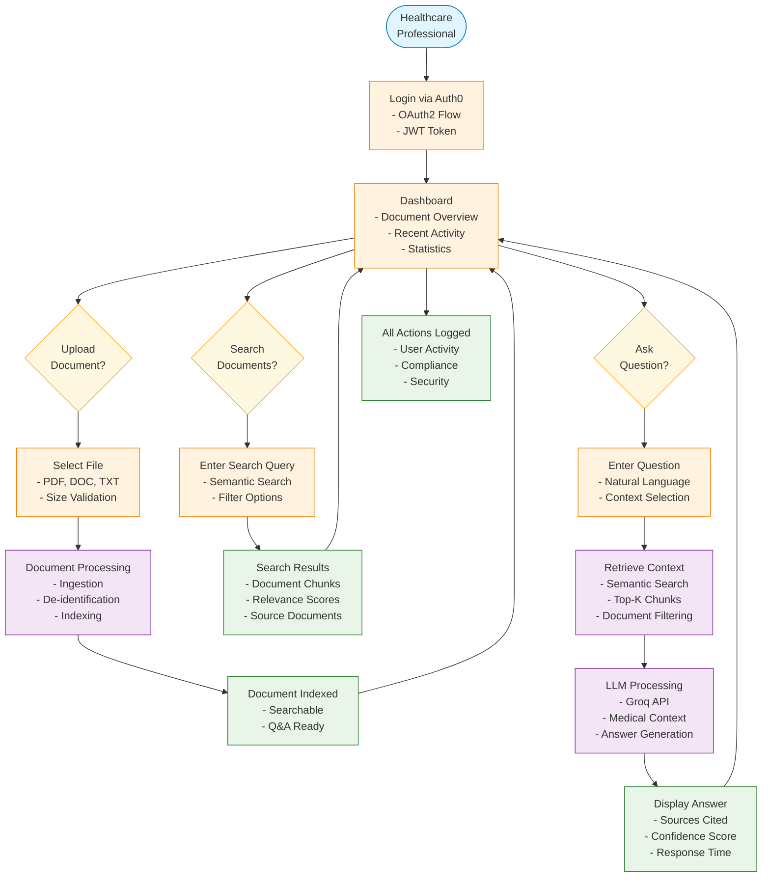
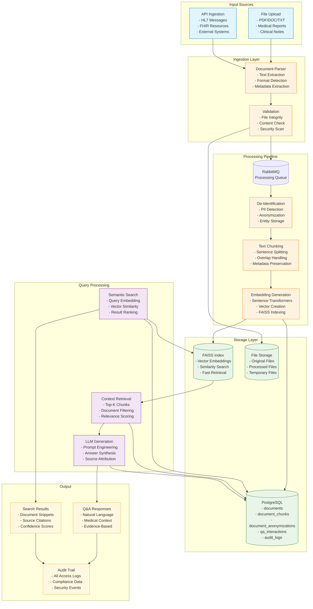
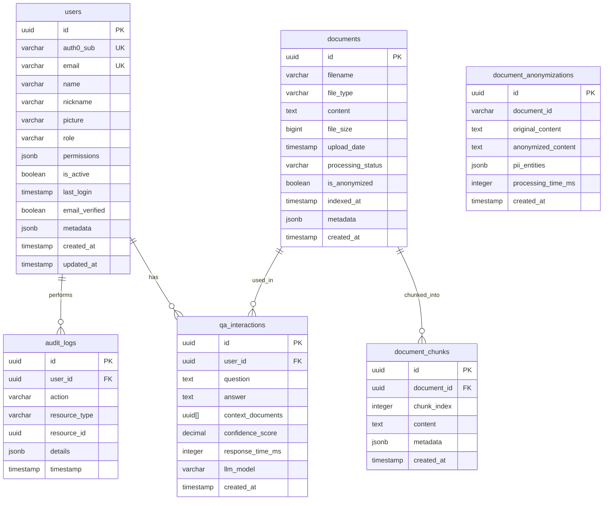
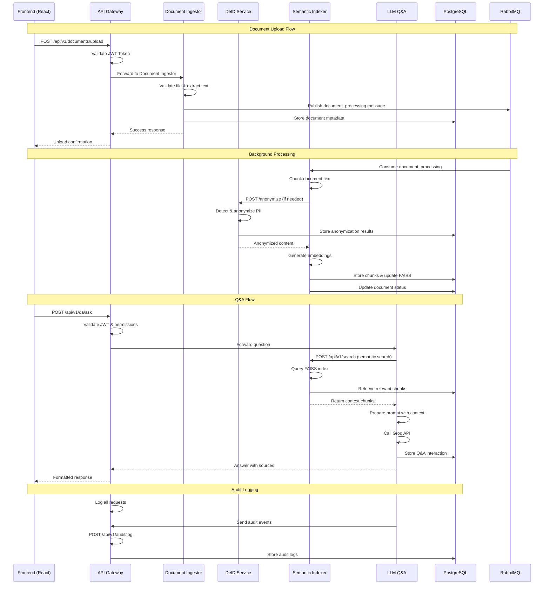

# DocQA-MS System Diagrams

This document contains all the architectural and process diagrams for the DocQA-MS (Medical Document Q&A System) project.

## Table of Contents
1. [Microservices Architecture](#microservices-architecture)
2. [BPMN - Document Processing Workflow](#bpmn---document-processing-workflow)
3. [Security Architecture](#security-architecture)
4. [Application Flow Diagram](#application-flow-diagram)
5. [Data Flow Diagram](#data-flow-diagram)
6. [Database Schema Diagram](#database-schema-diagram)
7. [API Interaction Diagram](#api-interaction-diagram)
8. [Deployment Architecture](#deployment-architecture)

---

## Microservices Architecture



---

## BPMN - Document Processing Workflow



---

## Security Architecture

```mermaid
flowchart TD
    subgraph "External Threats"
        Threats[Attack Vectors<br/>- XSS<br/>- CSRF<br/>- Injection<br/>- Unauthorized Access]
    end

    subgraph "Network Security"
        CDN[Vercel CDN<br/>- DDoS Protection<br/>- SSL/TLS<br/>- Global Edge]
        FW[Application Firewall<br/>- Request Filtering<br/>- Rate Limiting]
    end

    subgraph "Authentication Layer"
        Auth0[Auth0 Service<br/>- JWT Tokens<br/>- OAuth2/OIDC<br/>- MFA Support<br/>- User Management]
    end

    subgraph "API Gateway Security"
        JWT[Token Validation<br/>- RS256 JWT<br/>- Token Refresh<br/>- User Context]
        CORS[CORS Policy<br/>- Origin Control<br/>- Credential Handling]
        Headers[Security Headers<br/>- CSP<br/>- HSTS<br/>- X-Frame-Options<br/>- X-Content-Type]
    end

    subgraph "Application Security"
        AuthZ[Authorization<br/>- User Isolation<br/>- Role-Based Access<br/>- Resource Ownership]
        Input[Input Validation<br/>- Sanitization<br/>- Type Checking<br/>- SQL Injection Prevention]
        Audit[Audit Logging<br/>- All Actions<br/>- Compliance<br/>- Forensic Analysis]
    end

    subgraph "Data Security"
        Encrypt[Encryption<br/>- At Rest: Railway<br/>- In Transit: SSL<br/>- Database: PostgreSQL]
        Anon[Data Anonymization<br/>- PII Detection<br/>- Entity Replacement<br/>- Privacy Compliance]
        Backup[Secure Backups<br/>- Encrypted<br/>- Regular<br/>- Disaster Recovery]
    end

    Threats --> CDN
    CDN --> FW
    FW --> Auth0
    Auth0 --> JWT
    JWT --> CORS
    CORS --> Headers
    Headers --> AuthZ
    AuthZ --> Input
    Input --> Audit
    Audit --> Encrypt
    Encrypt --> Anon
    Anon --> Backup

    classDef threat fill:#ffebee,stroke:#c62828
    classDef network fill:#e8f5e8,stroke:#2e7d32
    classDef auth fill:#fff3e0,stroke:#f57c00
    classDef app fill:#f3e5f5,stroke:#7b1fa2
    classDef data fill:#e1f5fe,stroke:#0277bd

    class Threats threat
    class CDN,FW network
    class Auth0,JWT,CORS,Headers auth
    class AuthZ,Input,Audit app
    class Encrypt,Anon,Backup data
```



---

## Application Flow Diagram



---

## Data Flow Diagram



---

## Database Schema Diagram



---

## API Interaction Diagram



---

## Deployment Architecture

```mermaid
graph TB
    subgraph "Development"
        Dev[Local Development<br/>- VS Code<br/>- Docker Compose<br/>- Hot Reload]
    end

    subgraph "CI/CD Pipeline"
        Git[GitHub Repository<br/>- Source Code<br/>- Workflows<br/>- Secrets]
        Actions[GitHub Actions<br/>- Frontend Build<br/>- Backend Build<br/>- Testing<br/>- Security Scan]
    end

    subgraph "Production Hosting"
        Vercel[Vercel (Frontend)<br/>- React SPA<br/>- CDN<br/>- SSL/TLS<br/>- Global Edge]
        Railway[Railway (Backend)<br/>- Docker Containers<br/>- Internal Network<br/>- Auto Scaling<br/>- Health Checks]
    end

    subgraph "Railway Services"
        APIGW[API Gateway<br/>Container: api-gateway<br/>Port: 8000]
        DocIng[Document Ingestor<br/>Container: doc-ingestor<br/>Port: 8001]
        DeID[De-Identification<br/>Container: deid<br/>Port: 8002]
        Indexer[Semantic Indexer<br/>Container: indexer<br/>Port: 8003]
        LLMQA[LLM Q&A<br/>Container: llm-qa<br/>Port: 8004]
        Synth[Synthesis<br/>Container: synthesis<br/>Port: 8005]
        Audit[Audit Logger<br/>Container: audit-logger<br/>Port: 8006]
        ML[ML Service<br/>Container: ml-service<br/>Port: 8007]
    end

    subgraph "Infrastructure"
        Postgres[(PostgreSQL<br/>- 512MB Storage<br/>- Auto Backups<br/>- Connection Pooling)]
        RabbitMQ[(RabbitMQ<br/>- Message Queue<br/>- Task Distribution<br/>- Async Processing)]
        Redis[(Redis<br/>- Caching<br/>- Session Store<br/>- Rate Limiting)]
    end

    subgraph "External Services"
        Auth0[Auth0<br/>- Authentication<br/>- User Management<br/>- JWT Tokens<br/>- MFA]
        Groq[Groq API<br/>- LLM Inference<br/>- Medical Q&A<br/>- Context Processing]
    end

    Dev --> Git
    Git --> Actions
    Actions --> Vercel
    Actions --> Railway

    Railway --> APIGW
    Railway --> DocIng
    Railway --> DeID
    Railway --> Indexer
    Railway --> LLMQA
    Railway --> Synth
    Railway --> Audit
    Railway --> ML

    APIGW --> Postgres
    DocIng --> Postgres
    DeID --> Postgres
    Indexer --> Postgres
    LLMQA --> Postgres
    Audit --> Postgres
    ML --> Postgres

    DocIng --> RabbitMQ
    Indexer --> RabbitMQ

    LLMQA --> Groq
    APIGW --> Auth0

    classDef dev fill:#e1f5fe,stroke:#0277bd
    classDef cicd fill:#fff3e0,stroke:#f57c00
    classDef hosting fill:#e8f5e8,stroke:#2e7d32
    classDef service fill:#f3e5f5,stroke:#7b1fa2
    classDef infra fill:#fff8e1,stroke:#f9a825
    classDef external fill:#ffebee,stroke:#c62828

    class Dev dev
    class Git,Actions cicd
    class Vercel,Railway hosting
    class APIGW,DocIng,DeID,Indexer,LLMQA,Synth,Audit,ML service
    class Postgres,RabbitMQ,Redis infra
    class Auth0,Groq external
```

---

*This document provides comprehensive architectural documentation for the DocQA-MS system. Each diagram serves a specific purpose in understanding different aspects of the system architecture, from high-level component interactions to detailed data flows and security measures.*