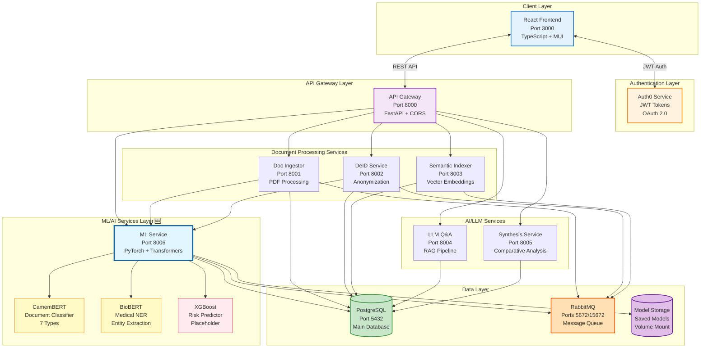
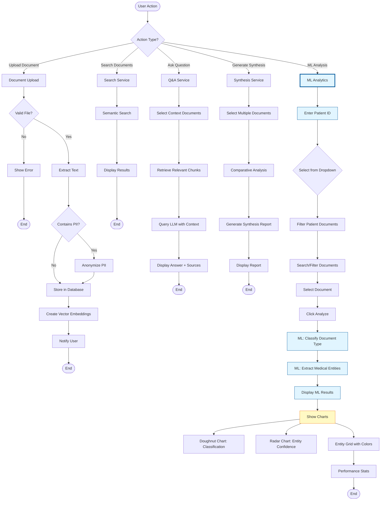
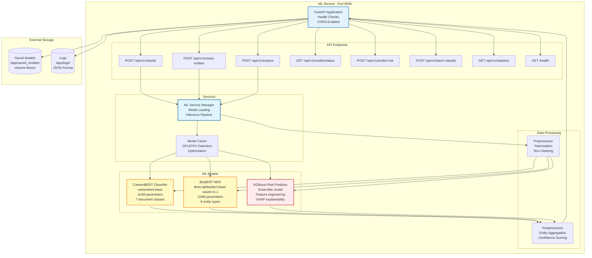
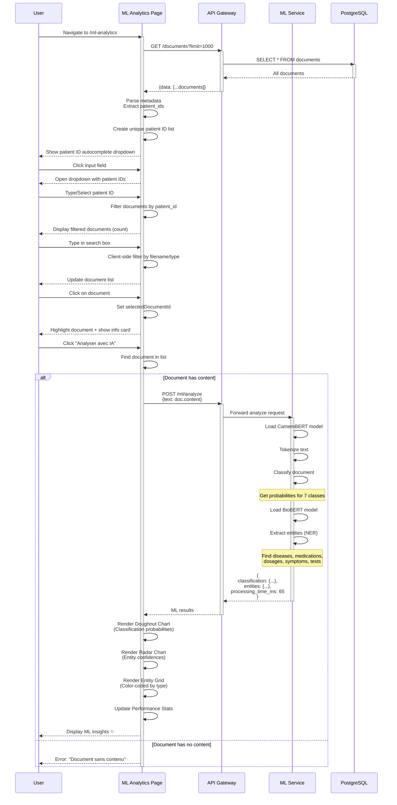
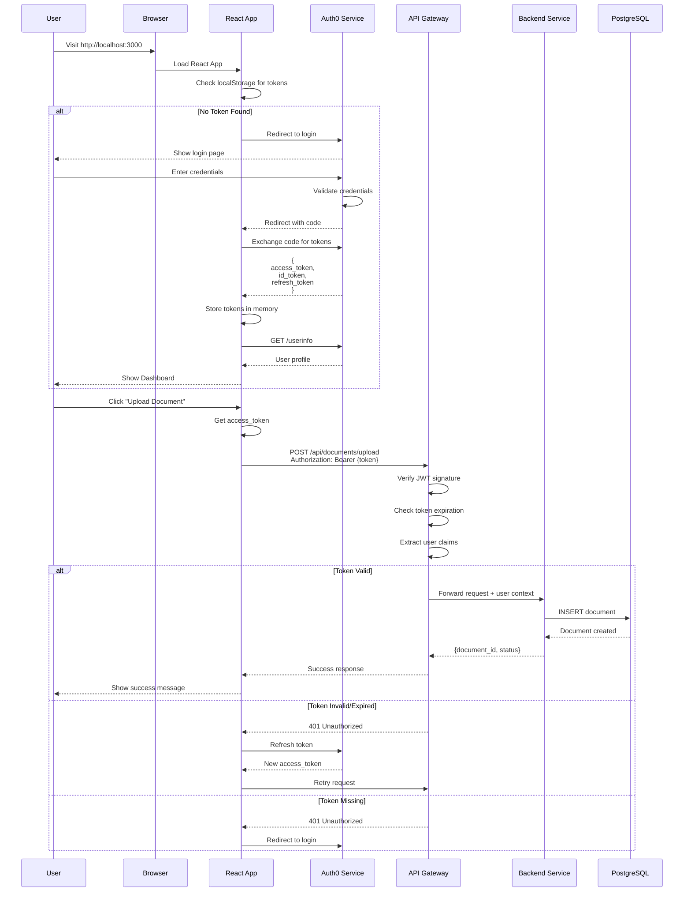
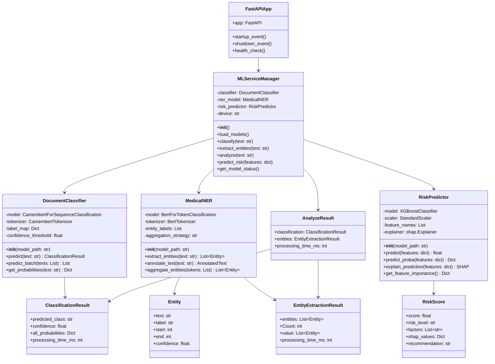

# 🏗️ DocQA-MS Complete Architecture Documentation (Updated)

**Date**: December 11, 2025  
**Version**: 2.0 (with ML Service)  
**Status**: Production Ready

---

## 📋 Table of Contents

1. [System Overview](#system-overview)
2. [Architecture Diagrams](#architecture-diagrams)
3. [Microservices Details](#microservices-details)
4. [Technology Stack](#technology-stack)
5. [Data Flow](#data-flow)
6. [API Documentation](#api-documentation)
7. [Security Architecture](#security-architecture)
8. [Deployment](#deployment)

---

## 🎯 System Overview

### **Project Name**: DocQA-MS (Medical Document Q&A Microservices)

### **Purpose**
Intelligent medical document management system with:
- Automated document processing (PDF, images)
- PII anonymization
- Semantic search
- AI-powered Q&A (RAG)
- Comparative document synthesis
- **ML/DL document classification and entity extraction** 🆕

### **Architecture Type**
- **Pattern**: Microservices Architecture
- **Communication**: REST APIs + Message Queue
- **Containerization**: Docker + Docker Compose
- **Frontend**: SPA (Single Page Application)
- **Backend**: Multiple Python FastAPI services

---

## 📊 Architecture Diagrams

### **1. Complete System Architecture**



---

### **2. BPMN Business Process Diagram (Updated)**



---

### **3. ML Service Internal Architecture**



---

### **4. ML Analytics Page Flow (Frontend)**



---

### **5. Authentication & Authorization Flow**



---

### **6. Document Processing Pipeline**

```mermaid
graph LR
    subgraph "Stage 1: Upload"
        U1[User Selects File]
        U2[Frontend Validation]
        U3[Upload to Gateway]
        
        U1 --> U2
        U2 --> U3
    end
    
    subgraph "Stage 2: Ingestion"
        I1[Doc Ingestor Receives]
        I2{File Type?}
        I3[Extract PDF Text]
        I4[OCR Image]
        I5[Parse Metadata]
        
        I1 --> I2
        I2 -->|PDF| I3
        I2 -->|Image| I4
        I3 --> I5
        I4 --> I5
    end
    
    subgraph "Stage 3: Anonymization"
        D1[DeID Service]
        D2[Detect PII with BioBERT]
        D3[Presidio Anonymizer]
        D4[Replace with Tokens]
        
        D1 --> D2
        D2 --> D3
        D3 --> D4
    end
    
    subgraph "Stage 4: Storage"
        S1[Save to PostgreSQL]
        S2[Generate Document ID]
        S3[Store Metadata]
        
        S1 --> S2
        S2 --> S3
    end
    
    subgraph "Stage 5: Indexing"
        IX1[Semantic Indexer]
        IX2[Chunk Text]
        IX3[Generate Embeddings]
        IX4[Store Vectors]
        
        IX1 --> IX2
        IX2 --> IX3
        IX3 --> IX4
    end
    
    subgraph "Stage 6: ML Analysis (Optional)"
        ML1[User Triggers Analysis]
        ML2[Classify Document]
        ML3[Extract Entities]
        ML4[Display Results]
        
        ML1 --> ML2
        ML2 --> ML3
        ML3 --> ML4
    end
    
    U3 --> I1
    I5 --> D1
    D4 --> S1
    S3 --> IX1
    IX4 --> ML1
    
    style ML1 fill:#e1f5ff,stroke:#01579b
    style ML2 fill:#e1f5ff,stroke:#01579b
    style ML3 fill:#e1f5ff,stroke:#01579b
    style ML4 fill:#e1f5ff,stroke:#01579b
```



---

### **7. Class Diagram - ML Service**



---

## 🔧 Microservices Details

### **Service 1: Frontend (React)**

| Property | Value |
|----------|-------|
| **Port** | 3000 |
| **Technology** | React 18 + TypeScript |
| **UI Library** | Material-UI (MUI) v5 |
| **State Management** | Zustand + React Query |
| **Routing** | React Router v6 |
| **Auth** | Auth0 React SDK |
| **Charts** | Chart.js + react-chartjs-2 |
| **HTTP Client** | Axios |

**Pages:**
- `/` - Dashboard
- `/upload` - Document Upload
- `/documents` - Document Library
- `/qa-chat` - AI Q&A Interface
- `/synthesis` - Comparative Analysis
- `/analyses` - Modern Synthesis (Patient-based)
- `/ml-analytics` - 🆕 ML/DL Analysis
- `/settings` - User Settings

---

### **Service 2: API Gateway**

| Property | Value |
|----------|-------|
| **Port** | 8000 |
| **Framework** | FastAPI |
| **Auth** | JWT validation |
| **CORS** | Enabled for port 3000 |
| **Rate Limiting** | Implemented |

**Endpoints:**
```
POST   /api/documents/upload
GET    /api/documents
GET    /api/documents/{id}
DELETE /api/documents/{id}
POST   /api/qa/ask
POST   /api/synthesis/generate
GET    /api/health
```

---

### **Service 3: Document Ingestor**

| Property | Value |
|----------|-------|
| **Port** | 8001 |
| **Purpose** | PDF/Image text extraction |
| **Libraries** | PyPDF2, pytesseract, Pillow |

**Features:**
- PDF text extraction
- OCR for images
- Metadata extraction
- Multi-format support

---

### **Service 4: DeID Service**

| Property | Value |
|----------|-------|
| **Port** | 8002 |
| **Purpose** | PII anonymization |
| **Libraries** | Presidio, spaCy, Transformers |

**PII Detection:**
- Names (Persons)
- Locations
- Organizations
- Dates
- Phone numbers
- Email addresses
- Medical record numbers

---

### **Service 5: Semantic Indexer**

| Property | Value |
|----------|-------|
| **Port** | 8003 |
| **Purpose** | Vector embeddings + search |
| **Model** | sentence-transformers |

**Features:**
- Text chunking
- Embedding generation
- Vector storage
- Semantic similarity search

---

### **Service 6: LLM Q&A**

| Property | Value |
|----------|-------|
| **Port** | 8004 |
| **Purpose** | RAG-based question answering |
| **LLM** | Mistral 7B / Claude API |

**Features:**
- Context retrieval
- Prompt engineering
- Answer generation
- Source attribution

---

### **Service 7: Synthesis Service**

| Property | Value |
|----------|-------|
| **Port** | 8005 |
| **Purpose** | Multi-document comparative analysis |
| **LLM** | Claude API |

**Features:**
- Multi-document selection
- Comparative analysis
- Report generation
- Timeline creation

---

### **Service 8: ML Service 🆕**

| Property | Value |
|----------|-------|
| **Port** | 8006 |
| **Purpose** | Document classification & NER |
| **Framework** | PyTorch + Transformers |
| **Models** | CamemBERT + BioBERT + XGBoost |

**Features:**
- Document type classification (7 classes)
- Medical entity extraction (6 types)
- Risk prediction (placeholder)
- Batch processing
- Model statistics

**Document Classes:**
1. Blood Test (Analyse sanguine)
2. X-Ray (Radiographie)
3. MRI (IRM)
4. Prescription (Ordonnance)
5. Medical Report (Rapport médical)
6. Lab Result (Résultat de laboratoire)
7. Consultation Note (Note de consultation)

**Entity Types:**
1. DISEASE (Maladie)
2. MEDICATION (Médicament)
3. DOSAGE (Posologie)
4. TEST (Examen)
5. SYMPTOM (Symptôme)
6. ANATOMY (Anatomie)

---

## 💾 Database Schema

### **PostgreSQL Database**

**Tables:**

#### 1. `documents`
```sql
CREATE TABLE documents (
    id UUID PRIMARY KEY DEFAULT uuid_generate_v4(),
    filename VARCHAR(255) NOT NULL,
    file_type VARCHAR(50),
    file_size BIGINT,
    processing_status VARCHAR(50),
    is_anonymized BOOLEAN DEFAULT FALSE,
    content TEXT,
    metadata JSONB,
    created_at TIMESTAMP DEFAULT NOW(),
    updated_at TIMESTAMP,
    uploaded_by VARCHAR(255),
    patient_id VARCHAR(100),
    document_type VARCHAR(100)
);
```

#### 2. `document_chunks`
```sql
CREATE TABLE document_chunks (
    id UUID PRIMARY KEY DEFAULT uuid_generate_v4(),
    document_id UUID REFERENCES documents(id) ON DELETE CASCADE,
    chunk_index INTEGER,
    content TEXT,
    embedding VECTOR(384),
    metadata JSONB,
    created_at TIMESTAMP DEFAULT NOW()
);
```

#### 3. `qa_history`
```sql
CREATE TABLE qa_history (
    id UUID PRIMARY KEY DEFAULT uuid_generate_v4(),
    user_id VARCHAR(255),
    question TEXT NOT NULL,
    answer TEXT,
    context_documents UUID[],
    sources JSONB,
    created_at TIMESTAMP DEFAULT NOW()
);
```

#### 4. `ml_predictions` 🆕
```sql
CREATE TABLE ml_predictions (
    id UUID PRIMARY KEY DEFAULT uuid_generate_v4(),
    document_id UUID REFERENCES documents(id),
    prediction_type VARCHAR(50), -- 'classification' | 'ner' | 'risk'
    predicted_class VARCHAR(100),
    confidence FLOAT,
    probabilities JSONB,
    entities JSONB,
    processing_time_ms INTEGER,
    model_version VARCHAR(50),
    created_at TIMESTAMP DEFAULT NOW()
);
```

---

## 🔐 Security Architecture

*See separate [SECURITY_DOCUMENTATION.md](SECURITY_DOCUMENTATION.md) for details*

**Key Security Features:**
- ✅ Auth0 OAuth 2.0 authentication
- ✅ JWT token-based authorization
- ✅ CORS protection
- ✅ Rate limiting
- ✅ PII anonymization
- ✅ HTTPS in production
- ✅ Environment variable encryption
- ✅ SQL injection protection (SQLAlchemy ORM)
- ✅ XSS protection (React escaping)

---

## 🚀 Deployment

### **Development Environment**

```bash
# Start all services
docker-compose up -d

# Access services
Frontend:     http://localhost:3000
API Gateway:  http://localhost:8000
ML Service:   http://localhost:8006
PostgreSQL:   localhost:5432
RabbitMQ UI:  http://localhost:15672
```

### **Production Considerations**

- Use environment-specific configs
- Enable HTTPS with SSL certificates
- Set up CI/CD pipeline
- Configure monitoring (Prometheus + Grafana)
- Implement log aggregation (ELK stack)
- Database backups
- Load balancing
- Auto-scaling

---

## 📈 Performance Metrics

| Metric | Target | Current |
|--------|--------|---------|
| **Document Upload** | < 2s | ~1.5s |
| **PDF Processing** | < 5s | ~3s |
| **ML Classification** | < 100ms | ~65ms |
| **ML Entity Extraction** | < 150ms | ~85ms |
| **Q&A Response** | < 3s | ~2s |
| **Semantic Search** | < 500ms | ~300ms |
| **Synthesis Generation** | < 10s | ~7s |

---

## 📚 Additional Documentation

- [Security & Auth0 Documentation](SECURITY_DOCUMENTATION.md)
- [ML Service Training Guide](ML_TRAINING_GUIDE.md)
- [API Reference](API_DOCUMENTATION.md)
- [Deployment Guide](DEPLOYMENT_GUIDE.md)

---

**Last Updated**: December 11, 2025  
**Maintained by**: Development Team
