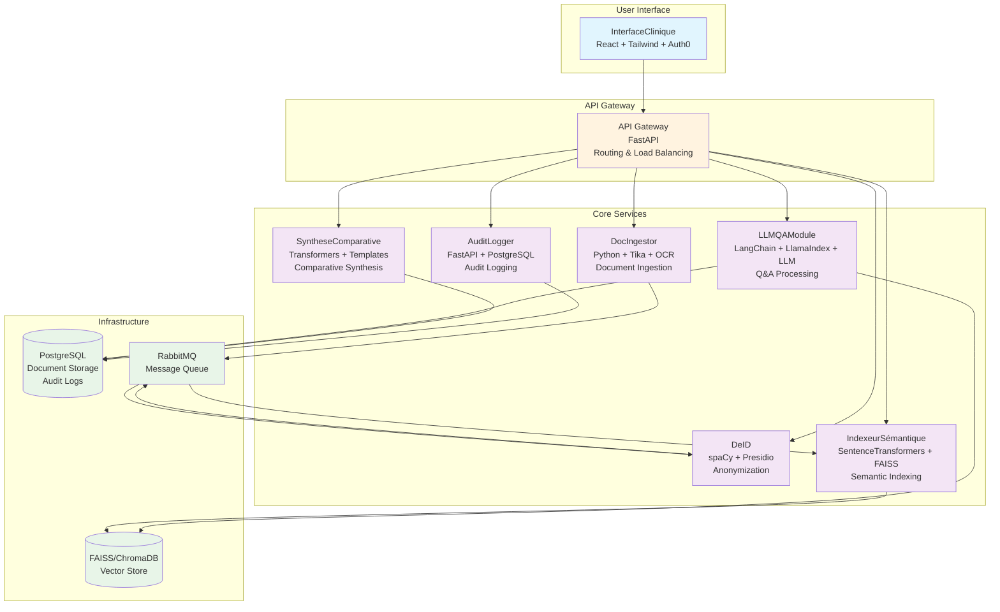

# DocQA-MS System Architecture

## Overview

DocQA-MS is a microservices-based medical document assistant that leverages Large Language Models (LLMs) to enable natural language querying of clinical documents. The system ensures data privacy through anonymization, provides semantic search capabilities, and maintains full audit trails for compliance.

## Architecture Diagram

## Data Flow

1. **Document Ingestion**: Documents are uploaded via InterfaceClinique → API Gateway → DocIngestor
2. **Processing Pipeline**:
   - DocIngestor extracts text and metadata
   - DeID anonymizes sensitive information
   - IndexeurSémantique creates vector embeddings
3. **Query Processing**:
   - User submits natural language query via InterfaceClinique
   - LLMQAModule retrieves relevant documents from vector store
   - LLM generates contextual response with citations
4. **Advanced Features**:
   - SyntheseComparative generates structured summaries and comparisons
   - AuditLogger records all interactions for compliance

## Technology Stack

- **Backend**: Python, FastAPI, PostgreSQL, RabbitMQ
- **AI/ML**: LangChain, LlamaIndex, SentenceTransformers, spaCy, Presidio
- **Frontend**: React, Tailwind CSS, Auth0
- **Infrastructure**: Docker, Kubernetes (optional), Prometheus/Grafana (optional)

## Security & Compliance

- **Data Privacy**: Automatic PII detection and removal via DeID service
- **Access Control**: Auth0 integration for authentication and authorization
- **Audit Trail**: Complete logging of all user interactions and system activities
- **Data Encryption**: End-to-end encryption for sensitive medical data

## Scalability Considerations

- **Microservices Architecture**: Independent scaling of services based on load
- **Message Queues**: Asynchronous processing for document ingestion pipeline
- **Vector Database**: Optimized for semantic search performance
- **GPU Support**: Optional GPU acceleration for LLM inference

## Deployment Strategy

- **Development**: Docker Compose with local services
- **Production**: Kubernetes orchestration with ingress controllers
- **CI/CD**: GitHub Actions for automated testing and deployment